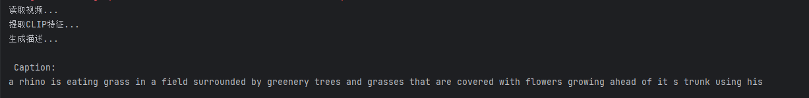
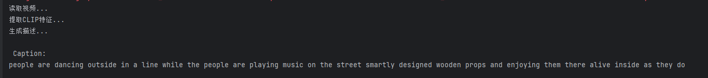
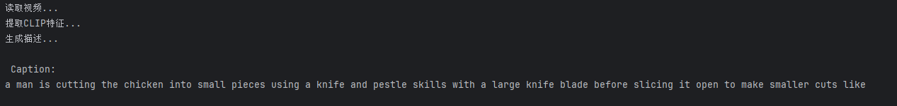

# Mini-VLM-Videos：一个轻量级的视频理解模型设计

## 一、背景与动机

这个项目的起点并不是视频，而是语音。致敬统一多模态的tokens

在此前的尝试中，已经实现了让语言模型“听懂声音”：通过将音频转为带有时间结构的特征序列，并输入给 LLM，使其能够对具有时序信息的 token 进行建模，并生成对应的语义描述。

在这个基础上，一个自然的延伸问题是：

> 既然语音和视频本质上都具有时序结构，那么只要解决“时间建模”的问题，是否可以用类似的方法让模型理解视频？

基于这个想法，模型采用了一种简单直接的方式：

* 将视频按时间采样（例如每秒提取若干帧）
* 得到一个具有时间顺序的视觉特征序列
* 再通过中间结构显式注入时间信息
* 最终对齐到语言模型进行推理

核心思路并不是设计复杂的视频模型，而是：

> 将视频转化为语言模型可以处理的“时序 token”，从而复用 LLM 的能力。
 
先来看一下效果（对应视频数据也在仓库里），如果模型就单一看一个帧是无法输出连贯的信息的，我们这模型完整描述了视频
可见模型是读取了整个视频进行描述的




---

## 二、整体思路

模型的目标是把视频表示为一段“语言前缀”，再交给语言模型生成文本。整体流程如下：

```id="hsfq1t"
视频帧 → 视觉编码 → 时间建模 → Q-Former压缩 → 映射到语言空间 → GPT2生成文本
```

可以分为三个关键步骤：

---

### 1. 视频转为时序特征

对视频按时间采样帧（例如均匀采样），使用视觉编码器（如 CLIP）提取每一帧的特征：

```id="y63oxb"
Video → [T, 512]
```

这里的 `T` 表示帧数，512 是特征维度。此时视频已经被表示为一个随时间变化的向量序列。

这种表示方式与语音类似，本质上都是“时间序列”。

---

### 2. 引入时间信息

仅有帧特征还不够，模型需要知道顺序信息。因此引入可学习的时间嵌入：

```
self.temp_emb = nn.Parameter(torch.randn(1, FIXED_FRAMES, 512))
visual_feats = visual_feats + self.temp_emb
```

这一步的作用类似于 Transformer 中的位置编码，用于区分不同时间步。

需要注意的是，这种方式只提供了“位置信息”，并没有显式建模运动或动态变化。

---

### 3. 使用 Q-Former 压缩序列

视频帧数量通常较多，直接送入语言模型不现实。因此引入 Q-Former，将长序列压缩为固定数量的语义 token。

输入：

```
visual_feats: [B, T, 512]
queries:      [B, 32, 512]
```

输出：

```
q_feats:      [B, 32, 512]
```

这里的 queries 是一组可学习参数，相当于从视频中“提取信息”的探针。

---

## 三、Q-Former 结构

每一层 QFormerBlock 包含三个部分：

### 1. Query 自注意力

```
q = self.norm1(q + self.attn(q, q, q)[0])
```

用于让 query token 之间进行信息交互。

---

### 2. 跨模态注意力

```
attn_out = self.cross_attn(q, visual_feats, visual_feats)
```

这是核心步骤，query 通过 attention 从视频特征中读取信息。

可以理解为：用一小组 token 去“总结”整个视频。

---

### 3. 前馈网络

```
q = self.norm3(q + self.ffn(q))
```

提升表达能力。

---

整体上，Q-Former 的作用是：

> 将长视频序列压缩为一组紧凑的语义表示。

---

## 四、对接语言模型

### 1. 维度对齐

Q-Former 输出维度为 512，需要映射到 GPT2 的 embedding 空间（768）：

```
self.fc = nn.Sequential(...)
```

---

### 2. Prefix 输入方式

将视觉特征作为前缀拼接到文本 embedding 前：

```
inputs_embeds = torch.cat([prefix, text_embeds], dim=1)
```

输入形式变为：

```
[视觉token][文本token]
```

语言模型会将前面的视觉 token 作为上下文条件。

---

### 3. Attention Mask

```
full_mask = torch.cat([prefix_mask, attention_mask], dim=1)
```

保证模型在生成文本时可以访问视觉信息。

---

### 4. 训练目标

```
labels = [-100, ..., -100, text tokens]
```

视觉部分不参与 loss，仅对文本部分计算损失。

这意味着模型学习的是：

> 在给定视觉前缀的条件下生成描述文本。

---

## 五、推理过程

推理时只输入视频特征：

1. 通过 Q-Former 得到 prefix
2. 将 prefix 输入 GPT2
3. 使用自回归生成文本

```
model.gpt2.generate(inputs_embeds=prefix, ...)
```

---

## 六、模型能力来源

模型的各部分承担不同功能：

| 模块       | 作用        |
| -------- | --------- |
| CLIP     | 提供视觉语义表示  |
| 时间嵌入     | 提供顺序信息    |
| Q-Former | 压缩和提取关键信息 |
| GPT2     | 生成自然语言    |

整体能力来自这些模块的组合，而不是单一组件。

---

## 七、设计特点

### 1. 不修改语言模型结构

通过 prefix 的方式接入视觉信息，避免对 GPT2 做结构性改动。

---

### 2. 信息压缩明确

Q-Former 将任意长度的视频压缩为固定数量的 token，有利于控制计算复杂度。

---

### 3. 实现简单

没有引入复杂的视频模型（如 3D CNN 或视频 Transformer），整体结构相对轻量。

---

## 八、存在的问题

### 1. 时间建模能力有限

当前仅使用：

```
visual_feats + temp_emb
```

无法建模真实的运动信息。

---

### 2. 缺乏层次结构

所有帧直接输入 Q-Former，长视频可能出现信息混杂。

---

### 3. 语言模型容量有限

GPT2 的表达能力在复杂场景下可能不足。

---

### 4. 缺少多模态预训练

没有进行显式的视觉-语言对齐训练（如对比学习），可能影响效果。

---

## 九、总结

该模型的核心思路可以概括为：

> 将视频转换为一段可被语言模型理解的前缀表示，再通过语言模型完成描述生成。

从实现角度看，这是一个相对简洁的多模态扩展方案：不依赖复杂的视频结构，而是通过“时序建模 + 表示对齐”来完成视频理解。

---
## 十、
如何使用
需要自备msvd数据集，这里推荐在魔搭平台下载,由于数据集过少，这里使用train，test，val数据集一起训练，请在训练前自己分离出一个样本作为val和test
首次运行train会进行视频特征提取，可以极快的加速训练
模型权重下载链接:通过网盘分享的文件：model_epoch20 (1).pth 链接: https://pan.baidu.com/s/1rPXhDGSBfpC5HX1UJ28T-g 提取码: td7k
这里推荐使用用msvd数据集，因为是avi格式，chat.py里面是根据msvd设计的函数
```
python train.py 
python chat.py
```

